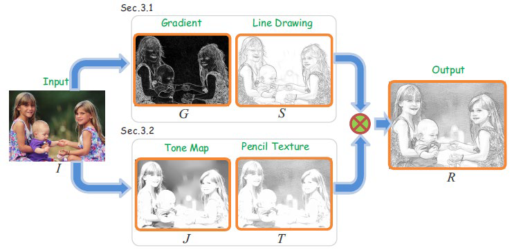

# 程序说明

## 流程图



## 函数说明

`main.py`:主程序

```python
main(image_path, mode, cfg, savename='output.jpg')
```

image_path:输入图片

mode:转换模式(彩色/黑白)

cfg:相关参数设置

savename:图片保存路径


`utils.py`:一些使用到的函数

```python
im2double(img)
```

**将图片像素的值归一化**

img:输入图片

```python
Laplace(x, sigma=9)
```

**Laplace分布**

```python
Uniform(x, ua=105, ub=225)
```

**均匀分布**

```python
Gaussian(x, u=90, sigma=11)
```

**高斯分布**


`drawing.py`:算法核心程序

```python
__strokeGeneration(self, img)
```

**生成笔画结构**

```python
__toneGeneration(self, img, mode=None)
```

**生成色调**

```python
__histogramMatching(self, img, mode=None)
```

**直方图匹配**

