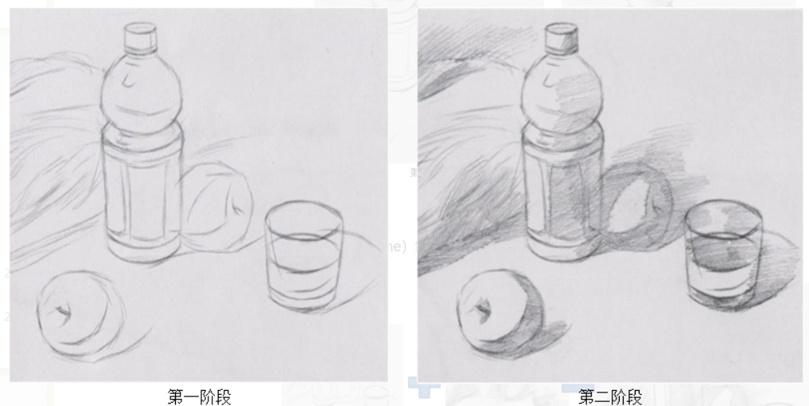
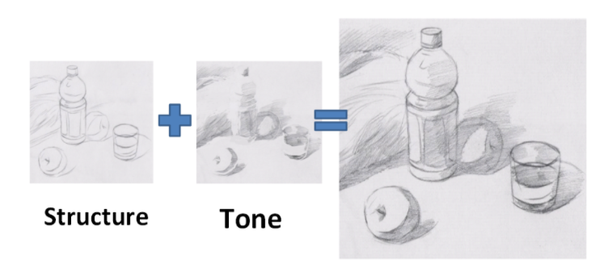
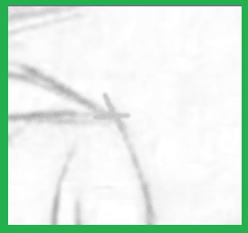
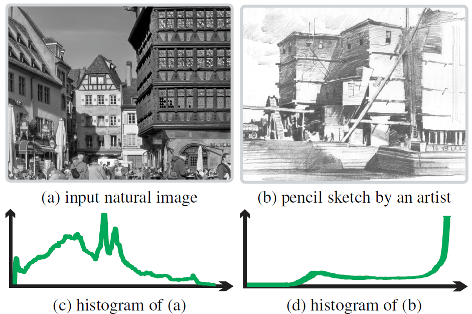
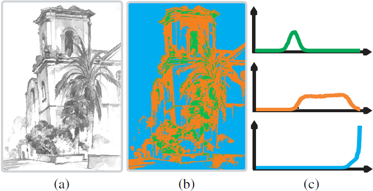
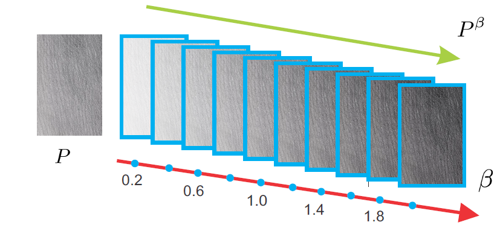

<!--
 * @Descripttion : 

 * @Author       : 傅宇千

 * @Date         : 2020-09-17 17:42:56

 * @LastEditors  : 傅宇千

 * @LastEditTime : 2020-09-21 00:34:00
    -->

  

[TOC]

# 论文阅读

*NPAR 2012*:Best Paper Award

International Symposium on Non-Photorealistic Animation and Rendering(非真实感的动画和渲染) , June, 2012

将其分为了两个阶段:

**笔画结构 Stroke Structure Generation**

**色调渲染 Tone Rendering**

## 详细步骤:

### Line Drawing with Strokes

第一步勾勒出物体的大致轮廓；第二步是对物体进行色调渲染，即用铅笔反复轻轻的划

目的:expressing general structures of the scene

图像特点:

在交叉点处具有十字形特点

#### 分类

##### 计算梯度图(边缘检测)

$$
G=\left(\left(\partial_{x} I\right)^{2}+\left(\partial_{y} I\right)^{2}\right)^{\frac{1}{2}}
$$

但是这样计算出来的梯度图噪声很大,且边缘部分的线条不连续，无法进行线的估计,所以提出新的步骤以得到更鲁棒的效果

##### 新步骤

选取八个方向的线段，应用以下公式得到各个方向的卷积图：
$$
G_{i}=\mathscr{L}_{i} * G
$$
方向分类公式如下:

选取一个点中最大的方向进行运动模糊
$$
C_{i}(p)=\left\{\begin{array}{cl}
G(p) & \text { if argmax }_{i}\left\{G_{i}(p)\right\}=i \\
0 & \text { otherwise }
\end{array}\right.
$$

$$
\sum_{i=1}^{8} C_{i}=G
$$

 其实这里的卷积就是按照指定的角度的运动模糊(和运动模糊的卷积核相差不大)

#### Line Shaping

得到笔画图:
$$
S^{\prime}=\sum_{i=1}^{8}\left(\mathscr{L}_{i} \otimes C_{i}\right)
$$
然后将$S'$归一化后得到最终的笔画输出$S$.

### Tone Drawing

目的:focuses more on shapes, shadow, and shading than on the use of lines

#### Model-based Tone Transfer

根据对大量的手工绘制的铅笔画图像数据的观察和分析，其直方图的分布和我们拍摄的图像有很大的不同(如下图)，但是都成一定的规律，这个规律可以用一定的经验公式来表达

在下图中，(a)是一副手工绘制的铅笔画，(b)图是硬性划分的阴影、柔和及高光图像，(c)图分别对应阴影、柔和及高光的直方图分布。可以看出，阴影部分基本成正态分布，柔和大致为均匀分布，而高光部分成拉普拉斯分布。因此，作者对三个部分分别构建了三个函数来模拟曲线。

公式如下:
$$
p(v)=\frac{1}{Z} \sum_{i=1}^{3} \omega_{i} p_{i}(v)
$$
$v$ is the tone value and $p(v)$ gives the probability that a pixel in a pencil drawing is with value $v$.$Z$为归一化常数使得$\int_{0}^{1} p(v) d v=1$. $w$为每个色调层的权重

##### 高光层(拉普拉斯分布)

 在人手工绘制的铅笔画中，由于纸张一般都是白色，因此，高光占有的比例实际上肯定是非常大的，这在直方图中反应就是在接近色阶255时分布曲线越陡峭。作者提出以下函数作为这部分的分布曲线。
$$
p_{1}(v)=\left\{\begin{array}{cl}
\frac{1}{\sigma_{b}} e^{-\frac{1-v}{\sigma_{b}}} & \text { if } v \leq 1 \\
0 & \text { otherwise }
\end{array}\right.
$$

##### 柔和层(均匀分布)

与亮层不同，柔和的色调层不一定在特定的灰度级达到峰值。艺术家通常使用许多具有不同压力的笔触来表达深度和细节水平。
$$
p_{2}(v)=\left\{\begin{array}{cl}
\frac{1}{u_{b}-u_{a}} & \text { if } u_{a} \leq v \leq u_{b} \\
0 & \text { otherwise }
\end{array}\right.
$$

##### 阴影层(高斯分布)

暗色的笔触强调物体的深度变化和几何轮廓。
$$
p_{3}(v)=\frac{1}{\sqrt{2 \pi \sigma_{d}}} e^{-\frac{\left(v-\mu_{d}\right)^{2}}{2 \sigma_{d}^{2}}}
$$

#### Parameter Learning

利用最大似然估计(MLE)估计每层的参数,最后得到如下参数:

| $w1$ | $w2$ | $w3$ | $\sigma_{b}$ | $u_{a}$ | $u_{b}$ | $\mu_{d}$ | $\sigma_{d}$ |
| :--: | :--: | :--: | :----------: | :-----: | :-----: | :-------: | :----------: |
|  52  |  37  |  11  |      9       |   105   |   225   |    90     |      11      |

然后进行直方图匹配

#### Pencil Texture Rendering

模拟人反复用铅笔描的过程(一个gamma矫正的过程，gamma值越高图像越黑),这里未知的就是区域渲染次数β，或者说深度。

求解:(耗时较长)
$$
\beta^{*}=\arg \min _{\beta}\|\beta \ln H-\ln J\|_{2}^{2}+\lambda\|\nabla \beta\|_{2}^{2}
$$
生成$T$
$$
T=H^{\beta^{*}}
$$

#### 最后结果

$$
R=S\cdot T
$$

对于彩色图像,将$R$当作YUV空间中的Y通道(色阶),再将其转化为RGB空间即可

## 项目过程
1.有些尺寸图片无法进行转换(猜想与卷积的过程设置有关)

2.速度比较缓慢(CG共轭梯度 第三步)